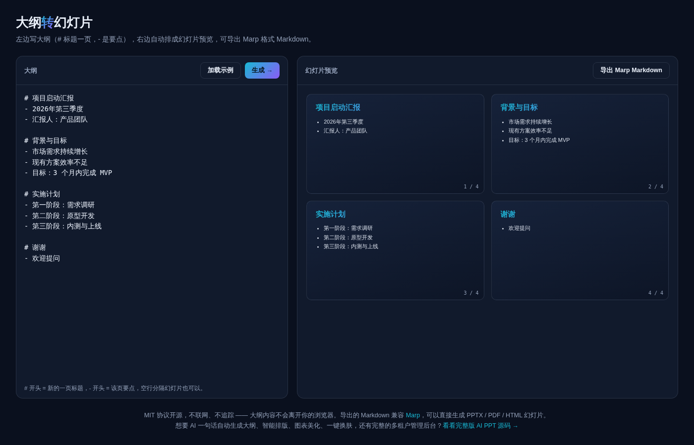

# 大纲转幻灯片 · Outline2Slides

**[在线体验 →](https://anna123123123-creator.github.io/outline2slides/)**

免费开源、纯浏览器运行的小工具：把文本大纲自动拆分成幻灯片结构，实时预览，一键导出 [Marp](https://marp.app/) 格式的 Markdown —— 可以直接用 Marp CLI / Marp for VS Code 生成真正的 PPTX、PDF 或 HTML 幻灯片。不用安装、不用注册、不联网。



## 试用方法

直接用浏览器打开 `index.html`，或用静态文件服务器跑起来：

```bash
python3 -m http.server 8000
```

## 大纲语法

```
# 第一页标题
- 要点一
- 要点二

# 第二页标题
- 要点一
```

`#` 开头新起一页，`-` 开头是该页要点，空行也可以用来分隔幻灯片。

## 导出后怎么用

导出的 `slides.md` 是标准 Marp 格式，装了 [Marp CLI](https://github.com/marp-team/marp-cli) 之后：

```bash
npx @marp-team/marp-cli slides.md --pptx
```

就能生成真正的 PPTX 文件。

## 协议

MIT。

## 相关项目

这个是做 **AI PPT** 产品时顺手做的免费小工具——只做"大纲拆分排版"这一步。完整版是一句话 AI 自动生成大纲、智能排版、图表美化、一键换肤，还有完整的多租户管理后台，源码在这：[全能源码 · AI PPT 网站源码](https://inzyxuashop.com/aippt-yuanma.html)。
